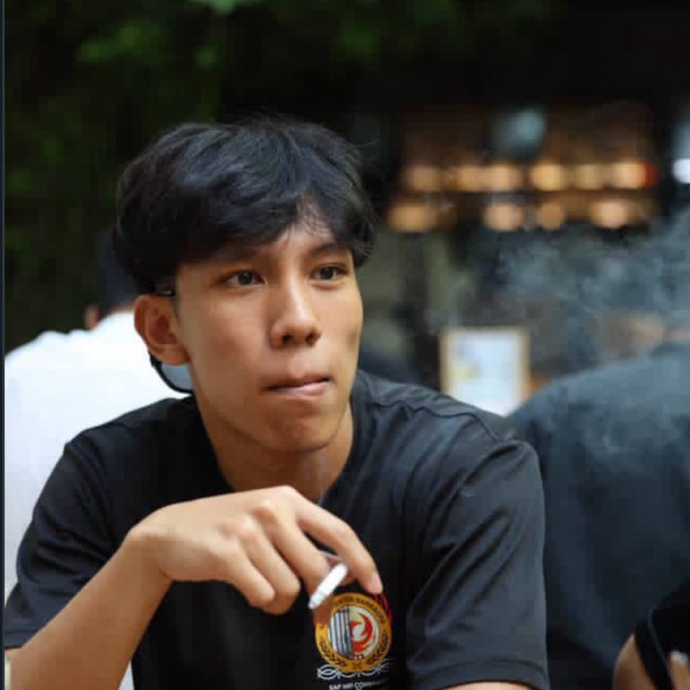

# About Us

We are a team based in the [School of Computing, National University of Singapore](http://www.comp.nus.edu.sg).

You can reach us by dropping by our CS2103T Tutorial session F15a!

## Project team

### Cyril Pedrina

[[github](https://github.com/cyfake)]
[[portfolio](team/cyfake.md)]

* Role: Developer
* Responsibilities: Integration

### Jane Doe

[[github](http://github.com/johndoe)]
[[portfolio](team/johndoe.md)]

* Role: Team Lead
* Responsibilities: UI

### Nicholas Chin

[[github](http://github.com/lanjia0)] [[portfolio](team/lanjia0.md)]

* Role: Developer
* Responsibilities: Integration, HashMap expert

### Jean Doe

[[github](http://github.com/johndoe)]
[[portfolio](team/johndoe.md)]

* Role: Developer
* Responsibilities: Dev Ops + Threading

### James Doe

[[github](http://github.com/johndoe)]
[[portfolio](team/johndoe.md)]

* Role: Developer
* Responsibilities: UI
