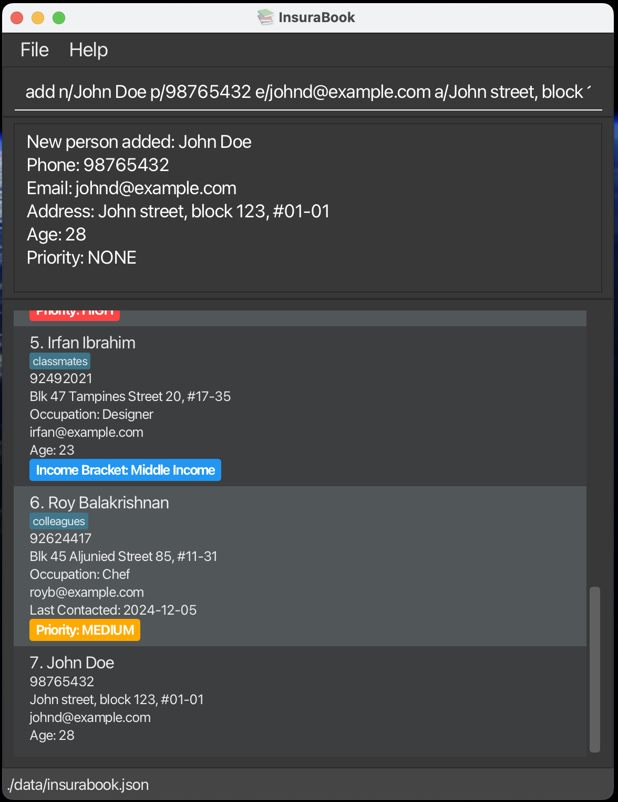
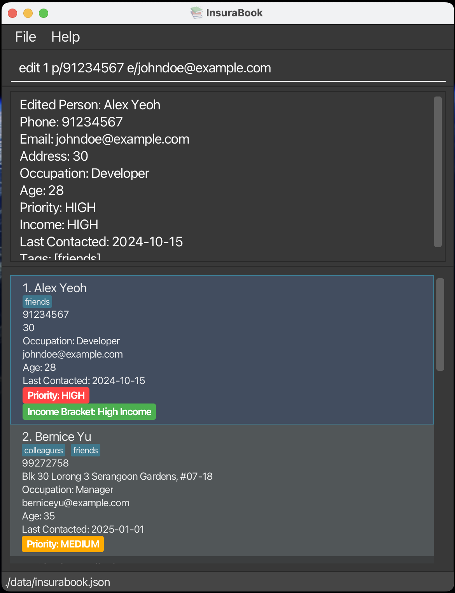
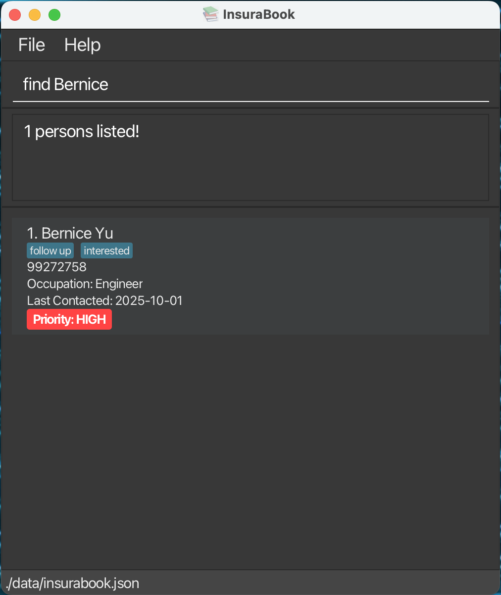
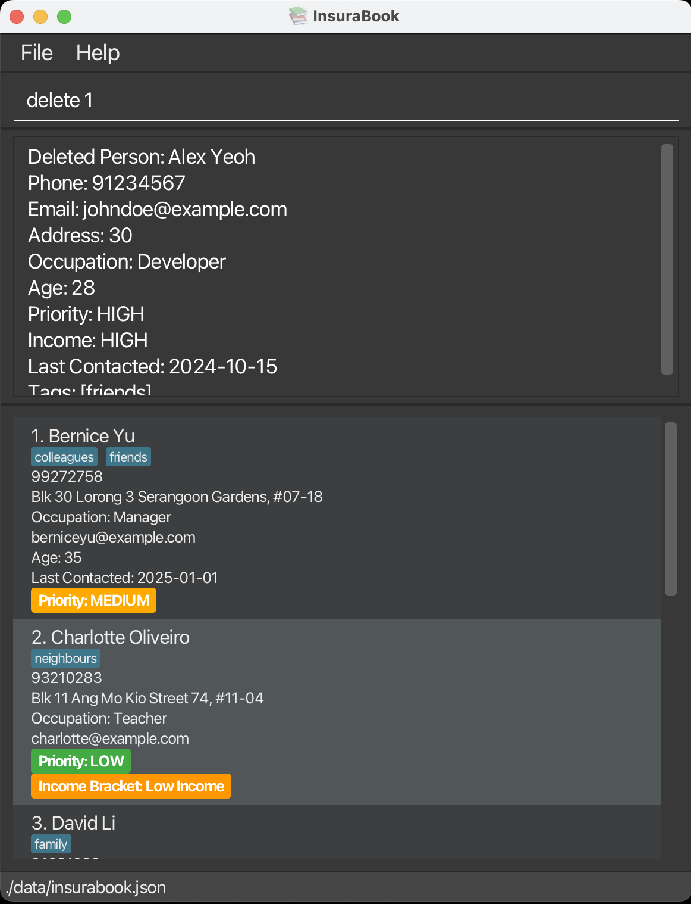
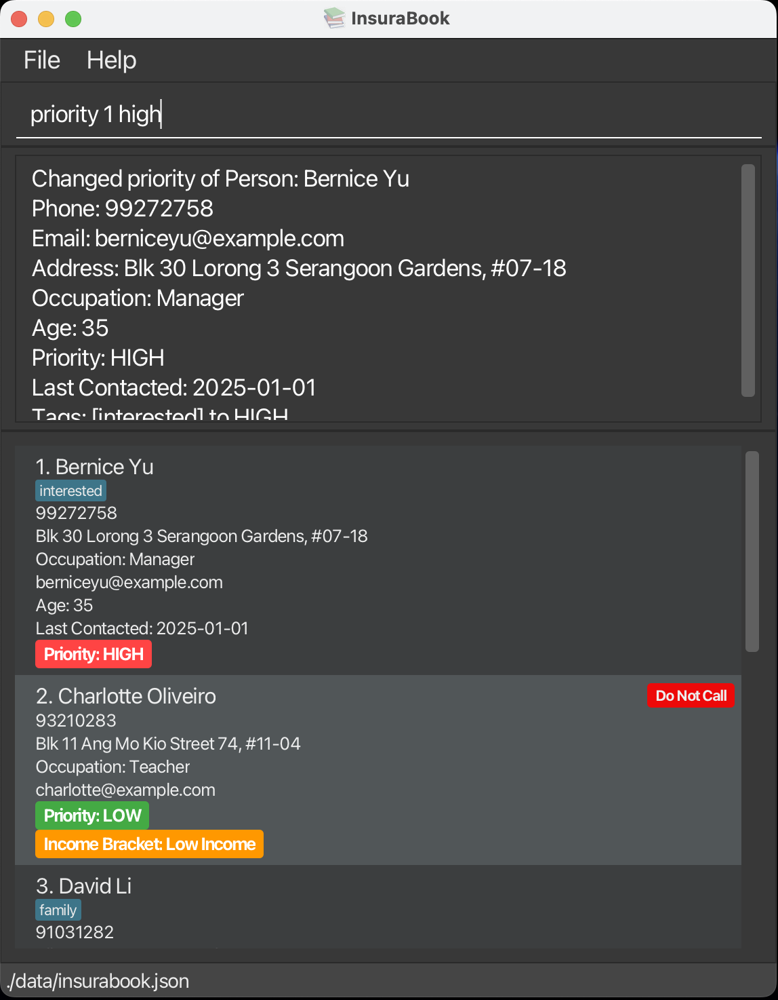

---
  layout: default.md
  title: "User Guide"
  pageNav: 3
--- 
# InsuraBook User Guide

InsuraBook is a **desktop app for managing contacts, optimized for use via a Command Line Interface** (CLI) while still having the benefits of a Graphical User Interface (GUI). If you can type fast, InsuraBook can get your contact management tasks done faster than traditional GUI apps.


**Target User**: Telemarketing Agents selling insurance who may need to manage a large contact list.

<!-- * Table of Contents -->
<page-nav-print />

--------------------------------------------------------------------------------------------------------------------

## Quick start

1. Ensure you have Java `17` or above installed in your Computer.

  **To check if Java 17+ is installed:**
  Open a command terminal/command prompt and type the following:
  ```
  java -version
  ```
  If Java 17 or higher is installed, you should see output similar to:

  ```
  java version "17.0.x" or higher
  ```
  If Java is not installed, or the Java version is below Java 17, proceed to install Java 17+

  **Installation links:**
  * **Mac users:** Follow the precise installation guide [here](https://se-education.org/guides/tutorials/javaInstallationMac.html)
  * **Windows/Linux users:** Download Java 17+ from [Oracle](https://www.oracle.com/java/technologies/downloads/) or [OpenJDK](https://openjdk.org/install/)

2. Download the latest `.jar` file from [here](https://github.com/se-edu/addressbook-level3/releases) **remember to change!**.

3. Copy the file to the folder you want to use as the _home folder_ for your AddressBook.

4. **To run the application:**<br>
    Open a command terminal/command prompt<br>
    Navigate to the folder containing the `.jar` file:
    ```
    cd path/to/your/folder
    ```
    Run the application:
    ```
    java -jar insurabook.jar
    ```
    A GUI similar to the one displayed below should appear within a few seconds. Note how the app contains some sample data.<br>
    <div style="text-align: center;">
        
    </div>

5. Type the command in the command box and press Enter to execute it. e.g. typing **`help`** and pressing Enter will open the help window.<br>
   Some example commands you can try:

   * `list` : Lists all contacts.

   * `add n/John Doe p/98765432 e/johnd@example.com a/John street, block 123, #01-01` : Adds a contact named `John Doe` to the Address Book.

   * `priority 1 HIGH` : Sets the priority of the 1st contact to HIGH.

   * `delete 3` : Deletes the 3rd contact shown in the current list.

   * `clear` : Deletes all contacts.

   * `exit` : Exits the app.

6. Refer to the [Features](#features) below for details of each command.

--------------------------------------------------------------------------------------------------------------------

## Features
<box type="info" seamless>

**Notes about the command format:**<br>

* Words in `UPPER_CASE` are the parameters to be supplied by the user.<br>
  e.g. in `add n/NAME`, `NAME` is a parameter which can be used as `add n/John Doe`.

* Items in square brackets are optional.<br>
  e.g `n/NAME [t/TAG]` can be used as `n/John Doe t/friend` or as `n/John Doe`.

* Items with `…`​ after them can be used multiple times including zero times.<br>
  e.g. `[t/TAG]…​` can be used as ` ` (i.e. 0 times), `t/friend`, `t/friend t/family` etc.

* Parameters can be in any order.<br>
  e.g. if the command specifies `n/NAME p/PHONE_NUMBER`, `p/PHONE_NUMBER n/NAME` is also acceptable.

* Extraneous parameters for commands that do not take in parameters (such as `help`, `exit` and `clear`) will be ignored.<br>
  e.g. if the command specifies `help 123`, it will be interpreted as `help`.

* If you are using a PDF version of this document, be careful when copying and pasting commands that span multiple lines as space characters surrounding line-breaks may be omitted when copied over to the application.
  </box>

### Viewing help : `help`

Shows a message explaining how to access the help page.

<div style="text-align: center;">
    
</div>

Format: `help`


### Adding a person: `add`

Adds a person to the address book.

<div style="text-align: center;">
    
</div>

Format: `add n/NAME p/PHONE_NUMBER [PERSON_PARAMS]`

* For details on available `PERSON_PARAMS`, click [here](#PERSON-PARAMS).

Examples:
* `add n/John Doe p/98765432 e/johnd@example.com a/John street, block 123, #01-01 age/28`
  * Adds a person named `John Doe` with the phone number `98765432`, email `johnd@example.com`,
  address `John street, block 123, #01-01`, age `28`.
* `add n/Betsy Crowe p/82345678 t/interested a/The Gardens at Bishan o/Engineer i/high pr/HIGH`
    * Adds a person named `Betsy Crowe` with phone number `82345678`, tagged as `interested`,
      address `The Gardens at Bishan`, occupation `Engineer`, income bracket `high`,
      and priority level `HIGH`.

<box type="warning" seamless>

**Warning:** Adding another person with the same `NAME` or `PHONE_NUMBER` as an existing person will be counted as a duplicate and is not allowed.

</box>

### Listing all persons : `list`

Shows a list of all persons sorted by index in the address book.

<div style="text-align: center;">
    
</div>

Format: `list [pr/asc] [pr/desc] [i/asc] [i/desc]`
- Addition of `pr/asc` lists the contacts sorted by priority in ascending order while `pr/desc` sorts in descending order.
- Addition of `i/asc` lists the contacts sorted by income bracket in ascending order while `i/desc` sorts in descending order.

<box type="warning" seamless>

**Warning:** You can only have up to **one** of the optional parameters.

</box>

### Editing a person : `edit`

Edits an existing person in the address book.

<div style="text-align: center;">
    
</div>

Format: `edit INDEX [n/NAME] [p/PHONE] [PERSON_PARAMS]`

* For details on available `PERSON_PARAMS`, click [here](#PERSON-PARAMS)
* Edits the person at the specified `INDEX`. The index refers to the index number shown in the displayed person list. The index **must be a positive integer** 1, 2, 3, …​
* At least one of the optional fields must be provided.

Examples:
*  `edit 1 p/91234567 e/johndoe@example.com`
    * Edits the phone number and email address of the 1st person to be `91234567` and `johndoe@example.com` respectively.
*  `edit 2 n/Betsy Crower t/ pr/HIGH`
    * Edits the name of the 2nd person to be `Betsy Crower`, clears all existing tags and changes the priority to HIGH.

<box type="warning" seamless>

**Warning:** When editing tags, the existing tags of the person will be removed i.e adding of tags is not cumulative.

</box>
<box type="tip" seamless>

**Tip:** You can remove all the person's tags using `edit INDEX t/`.

</box>

### Locating persons by name: `find`

Finds persons whose names contain any of the given keywords.

<div style="text-align: center;">
    
</div>

Format: `find KEYWORD [MORE_KEYWORDS]`

* The search is case-insensitive. e.g `hans` will match `Hans`
* The order of the keywords does not matter. e.g. `Hans Bo` will match `Bo Hans`
* Partial words will be matched e.g. `find Han` will match `Hans`
* Persons matching at least one keyword will be returned (i.e. `OR` search).
    * e.g. `Hans Bo` will return `Hans Gruber`, `Bo Yang`
* Values from fields `NAME`, `PHONE`, `EMAIL`, `ADDRESS`, `OCCUPATION`, `AGE`, `LAST_CONTACTED`, `TAG` are searched.

Examples:
* `find John` returns `john` and `John Doe`
* `find 87438807` returns `Alex Yeoh` as it matches their phone number
* `find family` returns `David Li` as it matches their assigned tags
* `find Alex family` returns `Alex Yeoh`, `David Li`
* `find alex david` returns `Alex Yeoh`, `David Li`<br>


### Deleting a person : `delete`

Deletes the specified person from the address book.

<div style="text-align: center;">
    
</div>

Format: `delete INDEX`

* Deletes the person at the specified `INDEX`.
* The index refers to the index number shown in the displayed person list.
* The index **must be a positive integer** 1, 2, 3, …​

Examples:
* `list` followed by `delete 2` deletes the 2nd person in the address book.
* `find Betsy` followed by `delete 1` deletes the 1st person in the results of the `find` command.

### Editing the tag: `tag`

Changes the tags of an existing person in the address book. This is a convenient shortcut for the edit command when you only want to change the tags.

<div style="text-align: center;">
    
</div>

Format: `tag INDEX t/TAG_NAME [t/TAG_NAME]...`

* Changes the tags of the person at the specified `INDEX`.
* The index refers to the index number shown in the displayed person list.
* The index **must be a positive integer** 1, 2, 3, …​
* `tag_name` must be  Alphanumeric and spaces allowed. 
    * Maximum 30 characters.
    * Case-insensitive (eg, Interested = interested). 
    * Leading/trailing spaces are trimmed.
* This command is equivalent to `edit INDEX t/tag_name`.

Examples:
* `tag 1 t/interested` Sets the tag of the 1st person to `interested`.
* `tag 2 t/follow up` Sets the tag of the 2nd person to `follow up`.
* `tag 5 t/do not call` Sets the tag of the 5th person to `do not call`.
* `tag 7 t/follow up t/interested` Sets the tags of the 7th person to `follow up` and `interested`.

<box type="tip" seamless>

**Tip:** Use the `tag` command for quick tag changes, or the `edit` command when changing multiple fields at once.
</box>

### Marking a contact as Do Not Call: `dnc`

Marks a contact as Do Not Call (DNC) in the address book.

<div style="text-align: center;">
    
</div>

Format: `dnc INDEX`

* Marks the person at the specified `INDEX` as Do Not Call.
* The index refers to the index number shown in the displayed person list.
* The index **must be a positive integer** 1, 2, 3, …​
* A special "Do Not Call" tag (displayed in red) will be applied to the contact.
* The DNC status **cannot be removed** from a contact.

Examples:
* `dnc 1` Marks the 1st person as Do Not Call.
* `dnc 3` Marks the 3rd person as Do Not Call.

<box type="warning" seamless>

**Warning:** Once a contact is marked as DNC, you cannot edit any of their information through any commands (including `edit`, `tag`, `priority`, etc.).

</box>

<box type="tip" seamless>

**Tip:** If a contact was wrongly assigned as DNC, delete the contact and re-add them to the system.
</box>

### Editing the priority: `priority`

Changes the priority of an existing person in the address book. This is a convenient shortcut for the edit command when you only want to change the priority.

<div style="text-align: center;">
    
</div>

Format: `priority INDEX PRIORITY`

* Changes the priority of the person at the specified `INDEX`.
* The index refers to the index number shown in the displayed person list.
* The index **must be a positive integer** 1, 2, 3, …​
* `PRIORITY` must be one of: `NONE`, `LOW`, `MEDIUM`, `HIGH` (case-insensitive)
* This command is equivalent to `edit INDEX pr/PRIORITY`

Examples:
* `priority 1 HIGH` Sets the priority of the 1st person to `HIGH`.
* `priority 3 NONE` Sets the priority of the 3rd person to `NONE`.
* `priority 2 medium` Sets the priority of the 2nd person to `MEDIUM` (case-insensitive).

<box type="tip" seamless>

**Tip:** Use the `priority` command for quick priority changes, or the `edit` command when changing multiple fields at once.
</box>

### Clearing all entries : `clear`

Clears all entries from the address book.

<div style="text-align: center;">
    
</div>

Format: `clear`

### Exiting the program : `exit`

Exits the program.

Format: `exit`

### Saving the data

InsuraBook data are saved in the hard disk automatically after any command that changes the data. There is no need to save manually.

### Editing the data file

InsuraBook data are saved automatically as a JSON file `[JAR file location]/data/InsuraBook.json`. Advanced users are welcome to update data directly by editing that data file.

<box type="warning" seamless>

**Caution:**
If your changes to the data file makes its format invalid, InsuraBook will discard all data and start with an empty data file at the next run.  Hence, it is recommended to take a backup of the file before editing it.<br><br>
Furthermore, certain edits can cause the InsuraBook to behave in unexpected ways (e.g., if a value entered is outside the acceptable range). Therefore, edit the data file only if you are confident that you can update it correctly.
</box>

--------------------------------------------------------------------------------------------------------------------

## PERSON_PARAMS

### Reading Parameter Formats

Before diving into each parameter, here's how to read the command formats:

| Format | Meaning | Example |
|--------|---------|---------|
| `PARAMETER` | Required, must provide | `n/NAME` must be included |
| `[PARAMETER]` | Optional, can skip | `[e/EMAIL]` can be omitted |
| `[PARAMETER]...` | Can repeat multiple times | `[t/TAG]...` → `t/friend t/vip` |
| `PARAMETER/` (empty) | Clears the field | `i/` removes income bracket |

The following parameters can be used when adding or editing a person. All parameters are optional unless otherwise specified:

Parameter | Description | Format | Constraints
----------|-------------|--------|------------
`e/EMAIL` | Email address | `e/EMAIL` | Must be a valid email format (e.g., `user@example.com`)
`a/ADDRESS` | Physical address | `a/ADDRESS` | Any text string
`o/OCCUPATION` | Person's occupation | `o/OCCUPATION` | Any text string
`age/AGE` | Person's age | `age/AGE` | Must be a positive integer
`lc/LAST_CONTACTED` | Last contact date | `lc/LAST_CONTACTED` | Must not be a future date. Format: `DD-MM-YYYY` (e.g., `25-12-2023`)
`pr/PRIORITY` | Contact priority level | `pr/PRIORITY` | Must be one of: `NONE`, `LOW`, `MEDIUM`, `HIGH` (case-insensitive)
`i/INCOME_BRACKET` | Income bracket classification | `i/INCOME_BRACKET` | Must be one of: `NONE`, `LOW`, `MEDIUM`, `HIGH` (case-insensitive)
`t/TAG` | Tags for categorization | `t/TAG` | Alphanumeric and spaces allowed. Maximum 30 characters. **Can be used multiple times** (e.g., `t/friend t/colleague`)

<box type="info" seamless>

**Notes about PERSON_PARAMS:**
* These parameters can be used in any combination with the `add` and `edit` commands
* Parameters can be specified in any order
* For the `edit` command, at least one parameter must be provided
* When editing tags with the `edit` command, existing tags will be replaced (not added to)
* To remove all tags, use `t/` without specifying any tags after it

</box>

--------------------------------------------------------------------------------------------------------------------

## Command summary

Action     | Format, Examples
-----------|----------------------------------------------------------------------------------------------------------------------------------------------------------------------
**Add**    | `add n/NAME p/PHONE_NUMBER [PERSON_PARAMS]` <br><br> e.g., `add n/James Ho p/22224444 e/jamesho@example.com a/123, Clementi Rd, 1234665 pr/HIGH t/friend t/colleague`
**Clear**  | `clear`
**Delete** | `delete INDEX`<br><br> e.g., `delete 3`
**DNC**    | `dnc INDEX`<br><br> e.g., `dnc 1`
**Edit**   | `edit INDEX [n/NAME] [p/PHONE] [PERSON_PARAMS]`<br><br> e.g.,`edit 2 n/James Lee e/jameslee@example.com pr/MEDIUM`
**Find**   | `find KEYWORD [MORE_KEYWORDS]`<br><br> e.g., `find James Jake`
**List**   | `list [pr/asc] [pr/desc] [i/asc] [i/desc]`
**Tag**    | `tag INDEX t/TAG_NAME [t/TAG_NAME]...` <br><br> e.g., `tag 1 t/interested t/follow up`
**Priority** | `priority INDEX PRIORITY`<br><br> e.g., `priority 1 HIGH`
**Help**   | `help`

--------------------------------------------------------------------------------------------------------------------

## FAQ

**Q**: How do I transfer my data to another Computer?<br>
**A**: Install the app in the other computer and overwrite `[JAR file location]/data/InsuraBook.json` with the file that contains the data of your previous AddressBook home folder.

--------------------------------------------------------------------------------------------------------------------

## Known issues

1. **When using multiple screens**, if you move the application to a secondary screen, and later switch to using only the primary screen, the GUI will open off-screen. The remedy is to delete the `preferences.json` file created by the application before running the application again.
2. **If you minimize the Help Window** and then run the `help` command (or use the `Help` menu, or the keyboard shortcut `F1`) again, the original Help Window will remain minimized, and no new Help Window will appear. The remedy is to manually restore the minimized Help Window.

