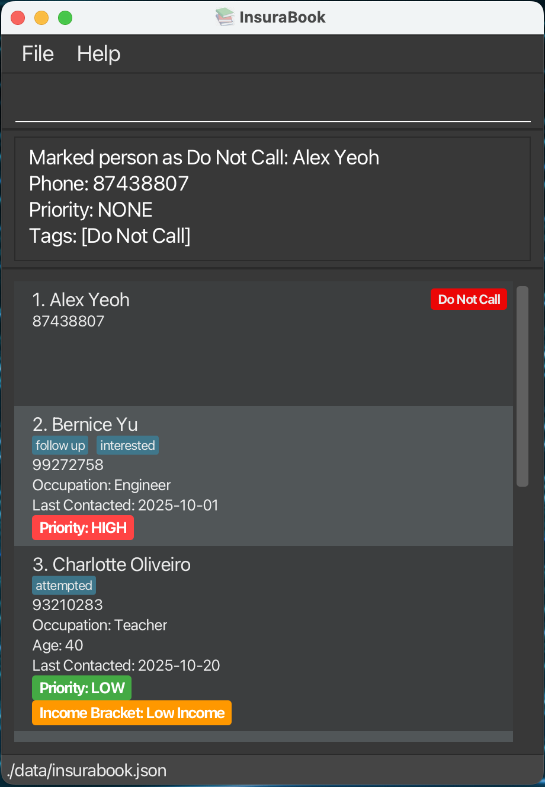

# InsuraBook User Guide

InsuraBook is a **desktop app for managing contacts, optimized for use via a  Line Interface** (CLI) while still having the benefits of a Graphical User Interface (GUI). If you can type fast, InsuraBook can get your contact management tasks done faster than traditional GUI apps.

<!-- * Table of Contents -->
<page-nav-print />

--------------------------------------------------------------------------------------------------------------------

## Quick start

1. Ensure you have Java `17` or above installed in your Computer. 
   **Mac users:** Ensure you have the precise JDK version prescribed [here](https://se-education.org/guides/tutorials/javaInstallationMac.html).

1. Download the latest `.jar` file from [here](https://github.com/se-edu/addressbook-level3/releases).

1. Copy the file to the folder you want to use as the _home folder_ for your AddressBook.

1. Open a command terminal, `cd` into the folder you put the jar file in, and use the `java -jar addressbook.jar` command to run the application. 
   A GUI similar to the below should appear in a few seconds. Note how the app contains some sample data. 
   

1. Type the command in the command box and press Enter to execute it. e.g. typing **`help`** and pressing Enter will open the help window. 
   Some example commands you can try:

   * `list` : Lists all contacts.

   * `add n/John Doe p/98765432 e/johnd@example.com a/John street, block 123, #01-01` : Adds a contact named `John Doe` to the Address Book.

   * `priority 1 HIGH` : Sets the priority of the 1st contact to HIGH.

   * `delete 3` : Deletes the 3rd contact shown in the current list.

   * `clear` : Deletes all contacts.

   * `exit` : Exits the app.

1. Refer to the [Features](#features) below for details of each command.

--------------------------------------------------------------------------------------------------------------------

## Features

<box type="info" seamless>

**Notes about the command format:** 

* Words in `UPPER_CASE` are the parameters to be supplied by the user. 
  e.g. in `add n/NAME`, `NAME` is a parameter which can be used as `add n/John Doe`.

* Items in square brackets are optional. 
  e.g `n/NAME [t/TAG]` can be used as `n/John Doe t/friend` or as `n/John Doe`.

* Items with `…`​ after them can be used multiple times including zero times. 
  e.g. `[t/TAG]…​` can be used as ` ` (i.e. 0 times), `t/friend`, `t/friend t/family` etc.

* Parameters can be in any order. 
  e.g. if the command specifies `n/NAME p/PHONE_NUMBER`, `p/PHONE_NUMBER n/NAME` is also acceptable.

* Extraneous parameters for commands that do not take in parameters (such as `help`, `list`, `exit` and `clear`) will be ignored. 
  e.g. if the command specifies `help 123`, it will be interpreted as `help`.

* If you are using a PDF version of this document, be careful when copying and pasting commands that span multiple lines as space characters surrounding line-breaks may be omitted when copied over to the application.
  </box>

### Viewing help : `help`

Shows a message explaining how to access the help page.

Format: `help`

### Adding a person: `add`

Adds a person to the address book.

Format: `add n/NAME p/PHONE_NUMBER [e/EMAIL] [a/ADDRESS] [o/OCCUPATION] [age/AGE] [lc/LAST_CONTACTED] [pr/PRIORITY] [t/TAG]…​`

* `PRIORITY` must be one of: `LOW`, `MEDIUM`, `HIGH` (case-insensitive)
* `LAST_CONTACTED` must not be a future date. Format: `DD-MM-YYYY` e.g. `25-12-2023`
* Email, address, occupation, age, last contacted, priority and tag fields are optional, only name and phone fields are required when adding a new contact

<box type="tip" seamless>

**Tip:** A person can have any number of tags (including 0) and an optional priority level

</box>
<box type="warning" seamless>

**Warning:** Adding another person with the same `NAME` as an existing person will be counted as a duplicate and is not allowed.

</box>

Examples:
* `add n/John Doe p/98765432`
* `add n/John Doe p/98765432 e/johnd@example.com a/John street, block 123, #01-01 age/28`
* `add n/Betsy Crowe t/friend e/betsycrowe@example.com a/Newgate Prison p/1234567 o/Financial Adviser t/criminal pr/HIGH`
* `add n/Jane Smith p/87654321 e/jane@example.com a/456 Main St pr/MEDIUM t/colleague`

### Listing all persons : `list`

Shows a list of all persons in the address book.

Format: `list`

### Editing a person : `edit`

Edits an existing person in the address book.

Format: `edit INDEX [n/NAME] [p/PHONE] [e/EMAIL] [a/ADDRESS] [o/OCCUPATION] [age/AGE] [lc/LAST_CONTACTED] [pr/PRIORITY] [i/INCOME_BRACKET] [t/TAG]…​`

* Edits the person at the specified `INDEX`. The index refers to the index number shown in the displayed person list. The index **must be a positive integer** 1, 2, 3, …​
* At least one of the optional fields must be provided.
* Existing values will be updated to the input values.
* When editing tags, the existing tags of the person will be removed i.e adding of tags is not cumulative.
* You can remove all the person’s tags by typing `t/` without
  specifying any tags after it.
* `PRIORITY` must be one of: `NONE`, `LOW`, `MEDIUM`, `HIGH` (case-insensitive)
* `INCOME_BRACKET` must be one of `LOW`, `MEDIUM`, `HIGH` (case-insensitive)

Examples:
*  `edit 1 p/91234567 e/johndoe@example.com` Edits the phone number and email address of the 1st person to be `91234567` and `johndoe@example.com` respectively.
*  `edit 2 n/Betsy Crower t/ pr/HIGH` Edits the name of the 2nd person to be `Betsy Crower`, clears all existing tags and changes the priority to HIGH.

### Locating persons by name: `find`

Finds persons whose names contain any of the given keywords.

Format: `find KEYWORD [MORE_KEYWORDS]`

* The search is case-insensitive. e.g `hans` will match `Hans`
* The order of the keywords does not matter. e.g. `Hans Bo` will match `Bo Hans`
* Names, tags and phone numbers are searched.
* Only full words will be matched e.g. `Han` will not match `Hans`
* Persons matching at least one keyword will be returned (i.e. `OR` search).
  e.g. `Hans Bo` will return `Hans Gruber`, `Bo Yang`

Examples:
* `find John` returns `john` and `John Doe`
* `find 87438807` returns `Alex Yeoh` as it matches their phone number
* `find family` returns `David Li` as it matches their assigned tags
* `find Alex family` returns `Alex Yeoh`, `David Li`
* `find alex david` returns `Alex Yeoh`, `David Li` 

### Deleting a person : `delete`

Deletes the specified person from the address book.

Format: `delete INDEX`

* Deletes the person at the specified `INDEX`.
* The index refers to the index number shown in the displayed person list.
* The index **must be a positive integer** 1, 2, 3, …​

Examples:
* `list` followed by `delete 2` deletes the 2nd person in the address book.
* `find Betsy` followed by `delete 1` deletes the 1st person in the results of the `find` command.

### Editing the tag: `tag`

Changes the tags of an existing person in the address book. This is a convenient shortcut for the edit command when you only want to change the tags.

Format: `tag INDEX t/TAG_NAME [t/TAG_NAME]...`

* Changes the tags of the person at the specified `INDEX`.
* The index refers to the index number shown in the displayed person list.
* The index **must be a positive integer** 1, 2, 3, …​
* You can specify multiple tags by using multiple `t/` prefixes
* All existing tags will be replaced by the new tags specified
* Each `TAG_NAME` must be alphanumeric and spaces allowed. Maximum 30 characters. Case-insensitive (eg, Interested = interested). Leading/trailing spaces are trimmed

Examples:
* `tag 1 t/interested` Sets the tag of the 1st person to `interested`.
* `tag 2 t/follow up` Sets the tag of the 2nd person to `follow up`.
* `tag 5 t/do not call` Sets the tag of the 5th person to `do not call`.
* `tag 7 t/follow up t/interested` Sets the tags of the 7th person to `follow up` and `interested`.

<box type="tip" seamless>

**Tip:** Use the `tag` command for quick tag changes, or the `edit` command when changing multiple fields at once.
</box>

### Marking a contact as Do Not Call: `dnc`

Marks a contact as Do Not Call (DNC) in the address book.

Format: `dnc INDEX`

* Marks the person at the specified `INDEX` as Do Not Call.
* The index refers to the index number shown in the displayed person list.
* The index **must be a positive integer** 1, 2, 3, …​
* A special "Do Not Call" tag (displayed in red) will be applied to the contact.
* Once a contact is marked as DNC, **none of its fields can be edited** through any commands (including `edit`, `tag`, `priority`, etc.).
* The DNC status **cannot be removed** from a contact.

<box type="warning" seamless>

**Warning:** Once a contact is marked as DNC, you cannot edit any of their information.
</box>

Examples:
* `dnc 1` Marks the 1st person as Do Not Call.
* `dnc 3` Marks the 3rd person as Do Not Call.

<box type="tip" seamless>

**Tip:** If a contact was wrongly assigned as DNC, delete the contact and re-add them to the system.
</box>

### Editing the priority: `priority`

Changes the priority of an existing person in the address book. This is a convenient shortcut for the edit command when you only want to change the priority.

Format: `priority INDEX PRIORITY`

* Changes the priority of the person at the specified `INDEX`.
* The index refers to the index number shown in the displayed person list.
* The index **must be a positive integer** 1, 2, 3, …​
* `PRIORITY` must be one of: `NONE`, `LOW`, `MEDIUM`, `HIGH` (case-insensitive)
* This command is equivalent to `edit INDEX pr/PRIORITY`

Examples:
* `priority 1 HIGH` Sets the priority of the 1st person to `HIGH`.
* `priority 3 NONE` Sets the priority of the 3rd person to `NONE`.
* `priority 2 medium` Sets the priority of the 2nd person to `MEDIUM` (case-insensitive).

<box type="tip" seamless>

**Tip:** Use the `priority` command for quick priority changes, or the `edit` command when changing multiple fields at once.
</box>

### Clearing all entries : `clear`

Clears all entries from the address book.

Format: `clear`

### Exiting the program : `exit`

Exits the program.

Format: `exit`

### Saving the data

AddressBook data are saved in the hard disk automatically after any command that changes the data. There is no need to save manually.

### Editing the data file

AddressBook data are saved automatically as a JSON file `[JAR file location]/data/addressbook.json`. Advanced users are welcome to update data directly by editing that data file.

<box type="warning" seamless>

**Caution:**
If your changes to the data file makes its format invalid, AddressBook will discard all data and start with an empty data file at the next run.  Hence, it is recommended to take a backup of the file before editing it. 
Furthermore, certain edits can cause the AddressBook to behave in unexpected ways (e.g., if a value entered is outside the acceptable range). Therefore, edit the data file only if you are confident that you can update it correctly.
</box>

### Archiving data files `[coming in v2.0]`

_Details coming soon ..._

--------------------------------------------------------------------------------------------------------------------

## FAQ

**Q**: How do I transfer my data to another Computer? 
**A**: Install the app in the other computer and overwrite the empty data file it creates with the file that contains the data of your previous AddressBook home folder.

--------------------------------------------------------------------------------------------------------------------

## Known issues

1. **When using multiple screens**, if you move the application to a secondary screen, and later switch to using only the primary screen, the GUI will open off-screen. The remedy is to delete the `preferences.json` file created by the application before running the application again.
2. **If you minimize the Help Window** and then run the `help` command (or use the `Help` menu, or the keyboard shortcut `F1`) again, the original Help Window will remain minimized, and no new Help Window will appear. The remedy is to manually restore the minimized Help Window.

--------------------------------------------------------------------------------------------------------------------

## Command summary

Action     | Format, Examples
-----------|----------------------------------------------------------------------------------------------------------------------------------------------------------------------
**Add**    | `add n/NAME p/PHONE_NUMBER e/EMAIL a/ADDRESS o/OCCUPATION [pr/PRIORITY] [t/TAG]…​`   e.g., `add n/James Ho p/22224444 e/jamesho@example.com a/123, Clementi Rd, 1234665 pr/HIGH t/friend t/colleague`
**Clear**  | `clear`
**Delete** | `delete INDEX`  e.g., `delete 3`
**DNC**    | `dnc INDEX`  e.g., `dnc 1`
**Edit**   | `edit INDEX [n/NAME] [p/PHONE_NUMBER] [e/EMAIL] [a/ADDRESS] [o/OCCUPATION] [pr/PRIORITY] [t/TAG]…​`  e.g.,`edit 2 n/James Lee e/jameslee@example.com pr/MEDIUM`
**Find**   | `find KEYWORD [MORE_KEYWORDS]`  e.g., `find James Jake`
**List**   | `list`
**Tag**    | `tag INDEX t/TAG_NAME [t/TAG_NAME]...`   e.g., `tag 1 t/interested t/follow up`
**Priority** | `priority INDEX PRIORITY`  e.g., `priority 1 HIGH`
**Help**   | `help`
